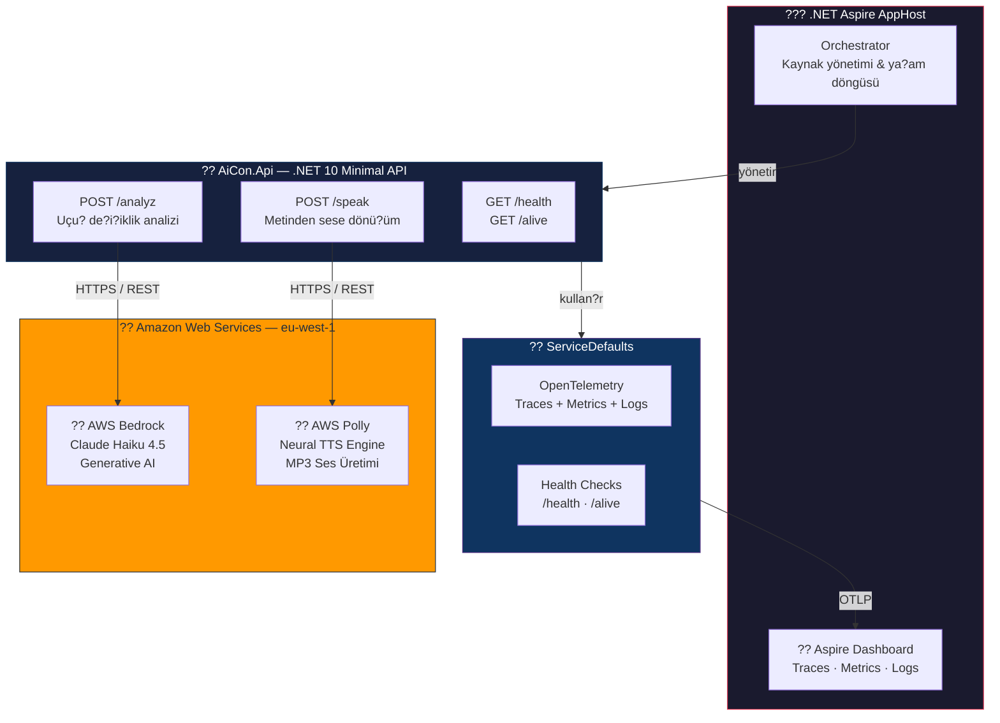
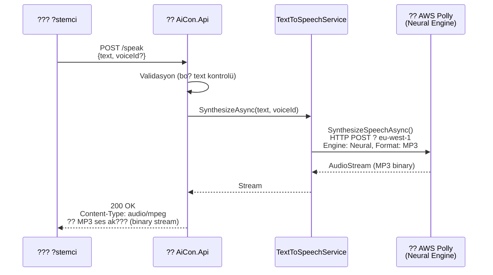
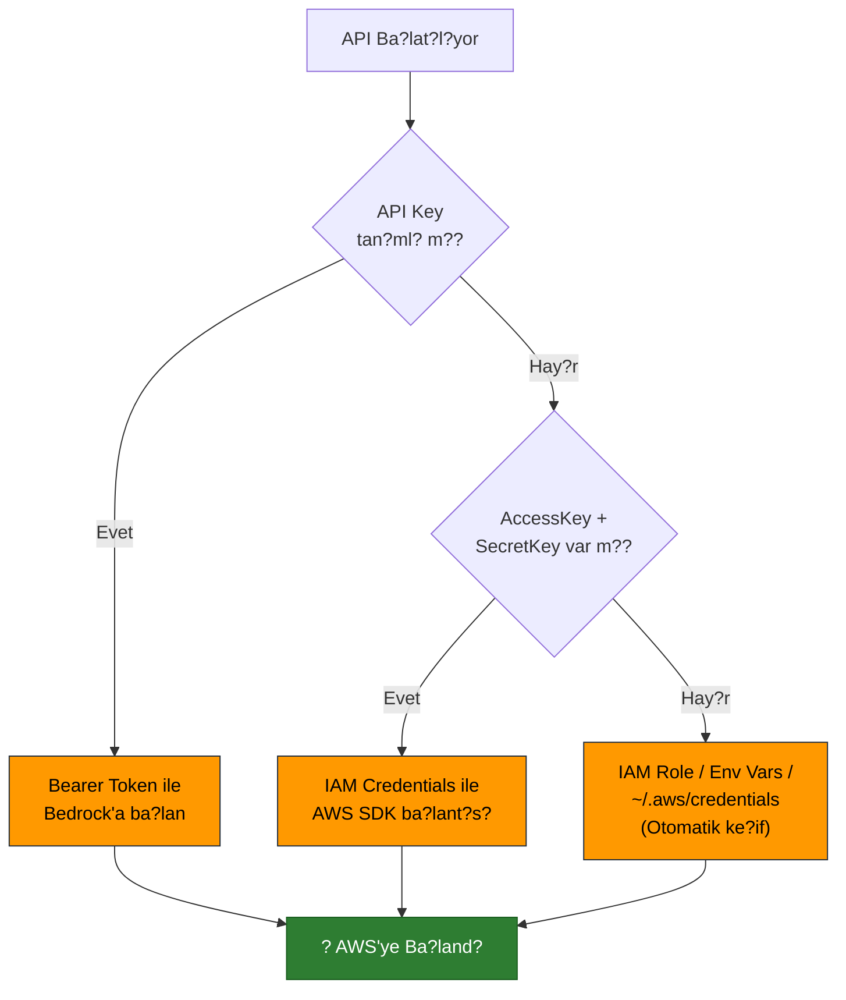
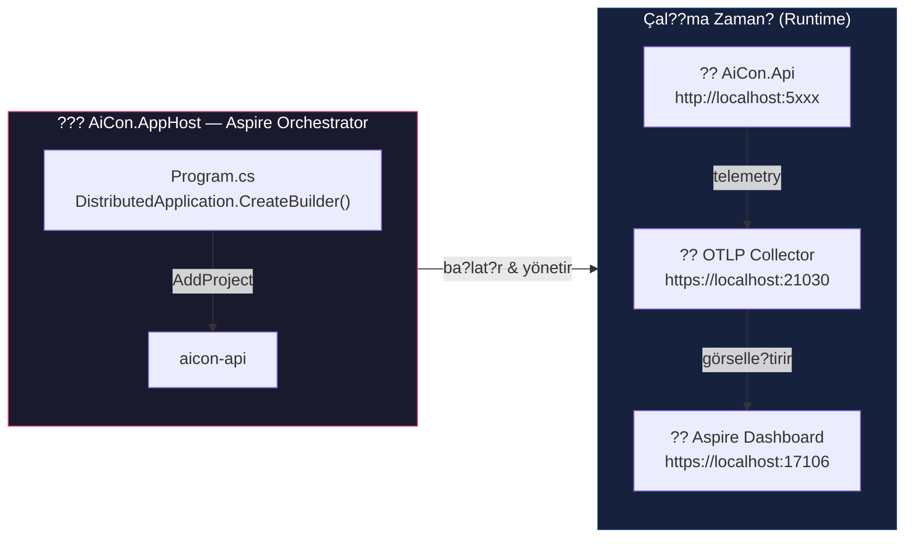
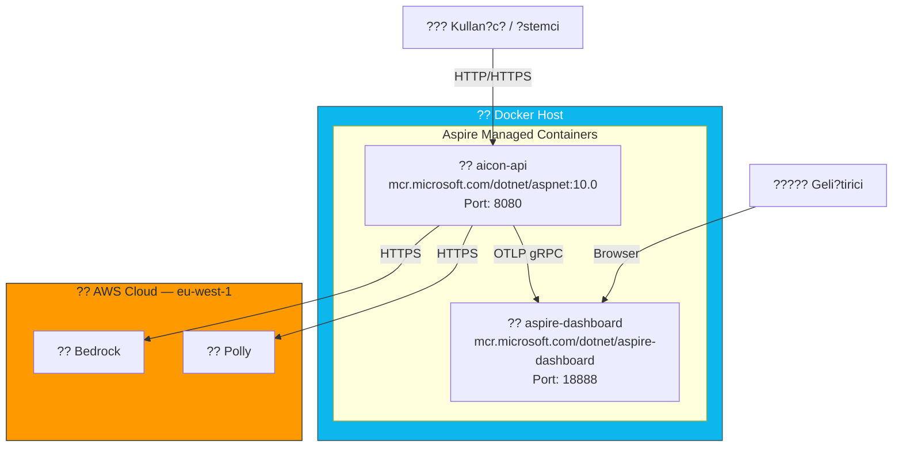

# ??? AiCon — Mimari Dokümantasyonu

> **Proje:** AiCon — AI-Powered Flight Operations Platform  
> **Framework:** .NET 10 + .NET Aspire 13.1  
> **Cloud Provider:** Amazon Web Services (AWS)  
> **Sunum Tarihi:** Temmuz 2025

---

## 1. Üst Düzey Mimari (High-Level Architecture)

A?a??daki ?ema, sistemin tüm bile?enlerini ve AWS ile olan ba?lant? noktalar?n? gösterir.

```
???????????????????????????????????????????????????????????????????????????????
?                        .NET ASPIRE ORCHESTRATOR                            ?
?                         (AiCon.AppHost)                                    ?
?                                                                            ?
?   ????????????????    ???????????????????????????????????????????????????  ?
?   ?   Aspire      ?    ?              AiCon.Api (.NET 10)               ?  ?
?   ?  Dashboard    ?    ?                                                ?  ?
?   ?              ?    ?  ????????????????????  ??????????????????????? ?  ?
?   ?  • Traces    ??????  ? FlightChange     ?  ?  TextToSpeech       ? ?  ?
?   ?  • Metrics   ?    ?  ? Analyzer         ?  ?  Service            ? ?  ?
?   ?  • Logs      ?    ?  ?                  ?  ?                     ? ?  ?
?   ?  • Resources ?    ?  ?  POST /analyz    ?  ?  POST /speak        ? ?  ?
?   ????????????????    ?  ????????????????????  ??????????????????????? ?  ?
?                        ?           ?                       ?            ?  ?
?   ????????????????    ?           ?    HTTPS/REST          ?            ?  ?
?   ? ServiceDef.  ?    ?           ?                       ?            ?  ?
?   ?              ?    ??????????????????????????????????????????????????  ?
?   ? • OTel       ?                ?                       ?               ?
?   ? • HealthCheck?                ?                       ?               ?
?   ????????????????                ?                       ?               ?
?                                   ?                       ?               ?
?????????????????????????????????????????????????????????????????????????????
                                    ?                       ?
                          ??????????????????????????????????????????????
                          ?   A M A Z O N   W E B   S E R V I C E S   ?
                          ??????????????????????????????????????????????
                                    ?                       ?
                          ??????????????????????  ?????????????????????
                          ?  AWS Bedrock        ?  ?  AWS Polly        ?
                          ?  (Claude Haiku 4.5) ?  ?  (Neural TTS)     ?
                          ?                     ?  ?                   ?
                          ?  Region: eu-west-1  ?  ?  Region: eu-west-1?
                          ?  Generative AI      ?  ?  Text ? MP3 Audio ?
                          ???????????????????????  ?????????????????????
```

---

## 2. Proje Yap?s? (Solution Structure)

```
AiCon.sln
?
??? src/
?   ??? AiCon.AppHost/          ? ???  Aspire Orchestrator (giri? noktas?)
?   ?   ??? Program.cs
?   ?   ??? Properties/
?   ?       ??? launchSettings.json
?   ?
?   ??? AiCon.Api/              ? ?? Ana API Servisi
?   ?   ??? Program.cs
?   ?   ??? Models/
?   ?   ?   ??? FlightChange.cs
?   ?   ?   ??? LegAnalysis.cs
?   ?   ?   ??? SpeakRequest.cs
?   ?   ??? Services/
?   ?   ?   ??? FlightChangeAnalyzer.cs    ? AWS Bedrock
?   ?   ?   ??? TextToSpeechService.cs     ? AWS Polly
?   ?   ??? Settings/
?   ?       ??? BedrockSettings.cs
?   ?       ??? PollySettings.cs
?   ?
?   ??? AiCon.ServiceDefaults/  ? ?? Payla??lan Aspire Altyap? Kodu
?       ??? Extensions.cs
?
??? docs/
    ??? architecture.md         ? ?? Bu dosya
```

---

## 3. Bile?en Detay ?emas? (Component Diagram)



---

## 4. ?stek Ak??? (Request Flow)

### 4.1 Uçu? Analizi Ak??? — `POST /analyz`

```mermaid
sequenceDiagram
    participant Client as ??? ?stemci
    participant API as ?? AiCon.Api
    participant Analyzer as FlightChangeAnalyzer
    participant Bedrock as ?? AWS Bedrock<br/>(Claude Haiku 4.5)
    participant Dashboard as ?? Aspire Dashboard

    Client->>API: POST /analyz<br/>[FlightChange listesi]
    API->>API: Validasyon (bo? liste kontrolü)
    API->>Analyzer: AnalyzeAsync(changes)

    Note over Analyzer: Prompt olu?turma:<br/>Her leg için de?i?iklik özeti<br/>JSON ç?kt? ?emas? tan?m?

    Analyzer->>Bedrock: InvokeModelAsync()<br/>HTTP POST ? eu-west-1
    
    Note over Bedrock: Claude Haiku 4.5<br/>Uçu? de?i?ikliklerini analiz eder<br/>Emoji + ba?l?k + detayl? aç?klama üretir

    Bedrock-->>Analyzer: JSON yan?t<br/>[{legId, title, analysis}]

    Analyzer->>Analyzer: ParseResponse()<br/>Markdown fence temizleme<br/>JSON deserialize

    Analyzer-->>API: IReadOnlyList&lt;LegAnalysis&gt;
    API-->>Client: 200 OK — JSON

    API-->>Dashboard: OpenTelemetry<br/>Trace + Metrics + Logs
```

### 4.2 Metinden Sese Dönü?üm Ak??? — `POST /speak`



---

## 5. AWS Ba?lant? Noktalar? (AWS Integration Points)

Bu bölüm, projenin AWS'ye hangi noktalardan, nas?l ve neden gitti?ini detayl? aç?klar.

```
?????????????????????????????????????????????????????????????????????????????????
?                    AWS BA?LANTI HAR?TASI                                    ?
?????????????????????????????????????????????????????????????????????????????????
?                                                                              ?
?  AiCon.Api                                                                   ?
?     ?                                                                        ?
?     ???? AWS Bedrock (eu-west-1)                                             ?
?     ?      • SDK: AWSSDK.BedrockRuntime v4.0.16                              ?
?     ?      • Model: Claude Haiku 4.5 (eu.anthropic.claude-haiku-4-5-*)       ?
?     ?      • Kullan?m: Uçu? de?i?iklik analizi (Generative AI)              ?
?     ?      • Auth: API Key (Bearer) VEYA IAM Credentials VEYA IAM Role      ?
?     ?      • Protokol: HTTPS REST (InvokeModel API)                          ?
?     ?                                                                        ?
?     ???? AWS Polly (eu-west-1)                                               ?
?            • SDK: AWSSDK.Polly v4.0.3                                        ?
?            • Engine: Neural                                                  ?
?            • Ses: Matthew (en-US)                                            ?
?            • Kullan?m: Metin ? MP3 ses dönü?ümü (Text-to-Speech)            ?
?            • Auth: IAM Credentials VEYA IAM Role                             ?
?            • Protokol: HTTPS REST (SynthesizeSpeech API)                     ?
?            • Ç?kt?: Binary MP3 stream (disk yaz?m? yok)                      ?
?                                                                              ?
?????????????????????????????????????????????????????????????????????????????????
```

### Kimlik Do?rulama Stratejisi (3 Katmanl? Fallback)



---

## 6. .NET 10 + Aspire Mimarisi

### Neden .NET 10 + Aspire?

```
????????????????????????????????????????????????????????????????????????
?                    .NET 10 + ASPIRE AVANTAJLARI                     ?
????????????????????????????????????????????????????????????????????????
?                                                                      ?
?  ?? .NET 10 (En Güncel LTS)                                         ?
?     • Minimal API ile yüksek performansl? HTTP endpoint'ler          ?
?     • Native AOT deste?i ? daha h?zl? cold-start                    ?
?     • Geli?tirilmi? System.Text.Json performans?                     ?
?     • En güncel güvenlik yamalar?                                    ?
?                                                                      ?
?  ??? .NET Aspire 13.1                                                 ?
?     • Tek komutla tüm servislerin orkestrasyon'u                     ?
?     • Dahili Dashboard: Traces, Metrics, Logs, Resources             ?
?     • OpenTelemetry entegrasyonu (s?f?r ek konfigürasyon)            ?
?     • Health Check yönetimi (/health, /alive)                        ?
?     • Container-first mimari (Docker ile do?al entegrasyon)          ?
?     • Geli?tirici deneyimi: F5 ile tüm sistem aya?a kalkar           ?
?                                                                      ?
?  ?? Gözlemlenebilirlik (Observability) — Yerle?ik                    ?
?     • OpenTelemetry Traces  ? Her HTTP iste?inin izlenmesi           ?
?     • OpenTelemetry Metrics ? Runtime & HTTP metrikleri              ?
?     • OpenTelemetry Logs    ? Yap?land?r?lm?? loglar                 ?
?     • OTLP Exporter         ? Aspire Dashboard'a otomatik gönderim  ?
?                                                                      ?
????????????????????????????????????????????????????????????????????????
```

### Aspire Orchestration ?emas?



---

## 7. Docker & Container Mimarisi

Aspire, Docker container'lar? do?al olarak destekler. A?a??da projenin container'ize edilmi? da??t?m modeli yer almaktad?r.



### Container Çal??t?rma Ak???

```
  Geli?tirici                    Aspire AppHost                 Docker
      ?                               ?                           ?
      ?  F5 (Visual Studio)           ?                           ?
      ?  veya: dotnet run             ?                           ?
      ?????????????????????????????????                           ?
      ?                               ?   Container image pull    ?
      ?                               ????????????????????????????
      ?                               ?                           ?
      ?                               ?   Container start         ?
      ?                               ????????????????????????????
      ?                               ?                           ?
      ?                               ?   Health check OK ?      ?
      ?                               ????????????????????????????
      ?                               ?                           ?
      ?   Dashboard URL aç?l?r        ?                           ?
      ?????????????????????????????????                           ?
      ?   https://localhost:17106     ?                           ?
      ?                               ?                           ?
```

---

## 8. API Endpoint Özeti

| Endpoint | Method | Aç?klama | AWS Servisi | Yan?t |
|----------|--------|----------|-------------|-------|
| `/` | GET | Sa?l?k kontrolü / ho?geldin | — | `text/plain` |
| `/analyz` | POST | Uçu? de?i?iklik analizi | **AWS Bedrock** (Claude) | `application/json` |
| `/speak` | POST | Metin ? Ses dönü?ümü | **AWS Polly** (Neural) | `audio/mpeg` (MP3 stream) |
| `/health` | GET | Genel health check | — | `200 OK / 503` |
| `/alive` | GET | Liveness probe | — | `200 OK / 503` |

---

## 9. Teknoloji Stack Özeti

```
???????????????????????????????????????????????????????????????
?  KATMAN                  TEKNOLOJ?               SÜRÜM     ?
???????????????????????????????????????????????????????????????
?  Runtime                 .NET                    10.0       ?
?  Orkestrasyon            .NET Aspire             13.1.1     ?
?  Web Framework           ASP.NET Core Minimal API 10.0      ?
?  Container               Docker                  —         ?
?  Gözlemlenebilirlik      OpenTelemetry           1.15.0    ?
?  AI / LLM                AWS Bedrock (Claude)    v4 SDK    ?
?  Text-to-Speech          AWS Polly               v4 SDK    ?
?  IDE                     Visual Studio 2025      18.x      ?
?  Versiyon Kontrol        Git + GitHub            —         ?
???????????????????????????????????????????????????????????????
```

---

## 10. Özet: Neden Bu Mimari?

| Karar | Gerekçe |
|-------|---------|
| **.NET 10** | En güncel framework — performans, güvenlik, uzun vadeli destek |
| **.NET Aspire** | Cloud-native orkestrasyon, yerle?ik observability, F5 ile tüm sistem aya?a kalkar |
| **AWS Bedrock (Claude)** | Uçu? operasyon analizi için enterprise-grade generative AI, EU region deste?i |
| **AWS Polly** | Dü?ük gecikmeli neural TTS, 40+ dil deste?i, stream tabanl? (disk I/O yok) |
| **Docker** | Ortam ba??ms?zl???, CI/CD kolayl???, Aspire ile do?al entegrasyon |
| **OpenTelemetry** | Vendor-agnostic observability standard?, Aspire Dashboard ile s?f?r config |
| **Minimal API** | Yüksek performans, dü?ük overhead, temiz kod yap?s? |

---

*Bu dokümantasyon, AiCon projesinin mevcut kaynak kodundan otomatik olarak üretilmi?tir.*
